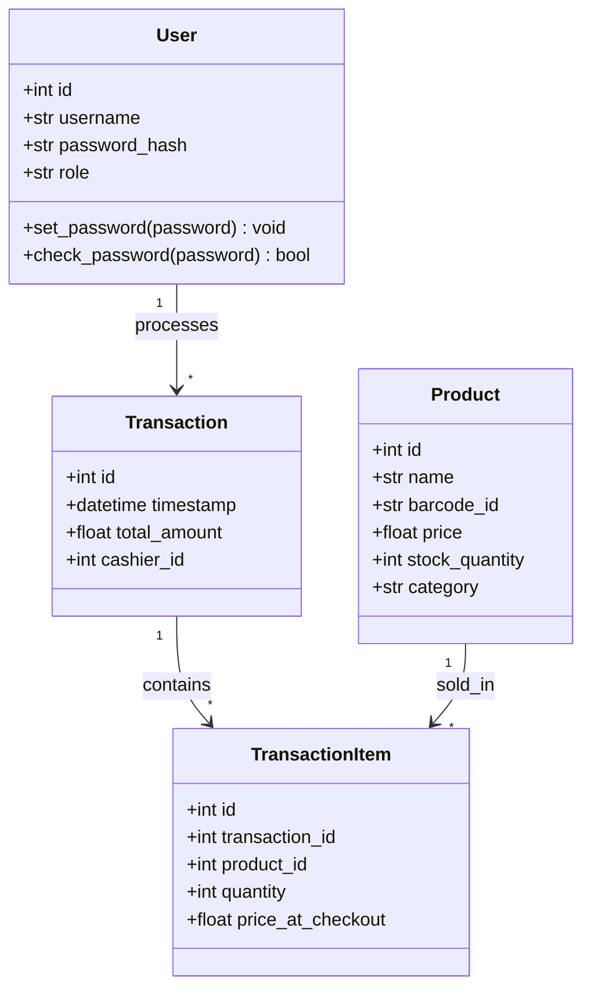

# UML Class Diagram
## POS System — Entity Relationships

**Version:** 1.0  
**Date:** 2026-06-29

---

## Class Diagram



---

## Entity Details

### User
| Attribute | Type | Constraints |
|-----------|------|-------------|
| `id` | Integer | Primary Key, Auto-increment |
| `username` | String(80) | Unique, Not Null |
| `password_hash` | String(256) | Not Null |
| `role` | String(20) | Not Null, Default: `'cashier'`, Values: `'admin'`, `'cashier'` |

**Methods:**
- `set_password(password)`: Hashes the plain-text password using `werkzeug.security.generate_password_hash()` and stores it in `password_hash`.
- `check_password(password)`: Verifies a plain-text password against the stored hash using `werkzeug.security.check_password_hash()`.

---

### Product
| Attribute | Type | Constraints |
|-----------|------|-------------|
| `id` | Integer | Primary Key, Auto-increment |
| `name` | String(120) | Not Null |
| `barcode_id` | String(50) | Unique, Not Null |
| `price` | Float | Not Null |
| `stock_quantity` | Integer | Not Null, Default: `0` |
| `category` | String(50) | Nullable |

---

### Transaction
| Attribute | Type | Constraints |
|-----------|------|-------------|
| `id` | Integer | Primary Key, Auto-increment |
| `timestamp` | DateTime | Not Null, Default: `utcnow` |
| `total_amount` | Float | Not Null |
| `cashier_id` | Integer | FK → `User.id`, Not Null |

**Relationships:**
- `cashier`: Many-to-One → `User`
- `items`: One-to-Many → `TransactionItem`

---

### TransactionItem
| Attribute | Type | Constraints |
|-----------|------|-------------|
| `id` | Integer | Primary Key, Auto-increment |
| `transaction_id` | Integer | FK → `Transaction.id`, Not Null |
| `product_id` | Integer | FK → `Product.id`, Not Null |
| `quantity` | Integer | Not Null |
| `price_at_checkout` | Float | Not Null |

**Relationships:**
- `transaction`: Many-to-One → `Transaction`
- `product`: Many-to-One → `Product`

---

## Relationship Summary

```
User (1) ──────→ (*) Transaction
                      via Transaction.cashier_id → User.id

Transaction (1) ──→ (*) TransactionItem
                      via TransactionItem.transaction_id → Transaction.id

Product (1) ────→ (*) TransactionItem
                      via TransactionItem.product_id → Product.id
```
